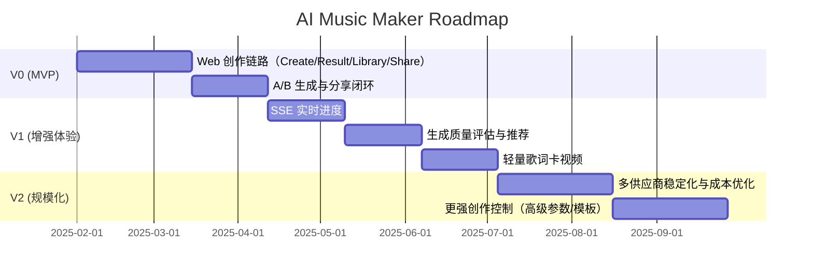

# AI Music Maker（V0-Web）PRD Professional

版本：V0-Web（Portfolio）  
状态：Draft  
更新日期：2025-01-24  

---

## 1. Executive Summary（执行摘要）

AI Music Maker 是一款面向大众创作的 AI 音乐生成产品，通过“上传/录音一段哼唱或清唱”，快速生成可保存、可分享的成品音乐。V0 以 Web（PC+移动自适应）为载体，跑通端到端创作流程并沉淀作品库，为后续 App 和更复杂能力铺路。

核心价值主张（Value Proposition）：
- 低门槛创作：无需乐理和编曲能力，输入 10-30 秒旋律即可产出完整音乐。
- 结果可控：一次生成 A/B 两个版本，用户可对比选择主版本。
- 可分享可沉淀：作品库与分享页形成创作闭环，驱动二次传播。

V0 交付范围：
- Web 端完整创作链路（Create → Generating → Result → Library → Share）。
- 录音/上传输入、重点片段选择、风格/文本控制、A/B 版本生成与选择。
- 作品库管理与分享链接。

北极星指标（North Star Metric）：
- 7 日内有效作品数（被用户选为主版本并保存的 Track）。

---

## 2. Market Analysis（市场分析）

### 2.1 市场规模（TAM / SAM / SOM，区间估算）
估算口径：以“内容创作者 + 泛音乐爱好者 + 中小营销团队”的音乐生成需求为核心，采用自下而上的用户量与年付费 ARPU 估算。

| 维度 | 定义 | 估算逻辑 | 规模区间（年） |
| --- | --- | --- | --- |
| TAM | 全球 AI 音乐创作工具市场 | 3,000-5,000 万潜在创作者 x 50-150 USD/年 | 15-75 亿 USD |
| SAM | 以 Web 端为主、可覆盖的市场 | 500-1,000 万潜在用户 x 30-100 USD/年 | 1.5-10 亿 USD |
| SOM | V0 可优先切入的细分市场 | 50-100 万早期用户 x 20-60 USD/年 | 1,000-6,000 万 USD |

> 备注：以上为产品规划阶段的区间估算，后续需基于真实转化与留存校准。

### 2.2 增长趋势
- AIGC 加速普及：生成式 AI 降低内容生产门槛，音乐成为下一波内容生成热点。
- 短视频与社媒需求持续增长：短内容平台对“可快速生成、可二次传播”的音乐需求增长。
- 版权与成本压力：传统商用音乐采购成本高，推动自动化配乐与快速生成工具的渗透。
- 模型质量快速提升：音频生成质量与速度持续改善，拉动用户对 AI 音乐的信任与使用频次。

### 2.3 竞品分析矩阵（代表性产品）

| 竞品类别 | 代表产品 | 输入方式 | 核心优势 | 主要不足 | 对标策略 |
| --- | --- | --- | --- | --- | --- |
| Text-to-Music | Suno / Udio | 文本、风格 | 生成质量高、体验流畅 | 对“哼唱旋律”支持弱 | 以“旋律输入 + A/B 选择”形成差异化 |
| AI 配乐/素材库 | Mubert / Soundraw | 文本/风格 | 素材覆盖广、B2B 友好 | 个性化与旋律表达弱 | 强化个人创作与作品沉淀 |
| 传统 DAW / 采样工具 | GarageBand 等 | 手工编曲 | 专业度高、控制强 | 学习成本高、效率低 | 面向非专业用户的低门槛替代 |

差异化定位：
- “哼唱/清唱 → 成品音乐”的创作范式，优先解决旋律表达问题。
- A/B 双版本输出，降低“第一次生成不满意”的失败感。
- 强调作品沉淀与分享链路，提升可传播性。

---

## 3. User Personas（用户画像）

### Persona A：短视频/自媒体创作者（内容驱动）
- 画像：24-32 岁，短视频运营或自媒体创作者，日常需要大量配乐。
- 目标：快速得到符合内容风格的背景音乐，可直接用在视频里。
- 痛点：版权音乐贵且重复率高；找素材耗时；音乐与内容不匹配。
- 典型场景：当天热点视频需要独特配乐，录一段哼唱快速生成。
- 成功定义：5 分钟内拿到可用音乐并完成发布。

### Persona B：独立音乐人/词曲作者（创作驱动）
- 画像：20-35 岁，具备基础乐感，但缺少编曲与制作资源。
- 目标：将旋律想法快速变成 Demo，用于创作验证或团队沟通。
- 痛点：编曲门槛高；制作周期长；尝试成本大。
- 典型场景：写了一段旋律，录音后生成 A/B 版本快速比较风格。
- 成功定义：可复用的 Demo，方便迭代和分享。

### Persona C：品牌/营销团队（商业驱动）
- 画像：小型品牌或营销团队，预算有限，追求可控的品牌音乐素材。
- 目标：低成本、可控的品牌音乐，用于广告/短片/活动。
- 痛点：定制音乐成本高，授权流程复杂。
- 典型场景：活动宣传片需要主题旋律，快速生成多版本供选择。
- 成功定义：可商用的可控素材，满足品牌一致性。

---

## 4. User Journey Map（用户旅程图）


关键触点说明：
- Create：输入与控制复杂度高，是转化关键。
- Result：A/B 对比和选择决定“有效作品”。
- Library/Share：形成留存与传播的闭环。

---

## 5. Product Vision & Strategy（产品愿景与策略）

### 5.1 愿景（Vision）
让任何人用一句哼唱就能创作并分享一首完整音乐。

### 5.2 产品策略
- 极简输入：先解决“把想法变成声音”的门槛问题。
- 结果可控：A/B 版本 + 清晰选择机制，提升满意度。
- 分享驱动增长：作品库 + 分享页形成传播闭环。

### 5.3 OKR（示例）

| Objective | Key Results |
| --- | --- |
| O1：验证 V0 核心价值 | KR1：Create → Generate 提交转化率 >= 35% ；KR2：生成成功率 >= 95% ；KR3：A/B 选择率 >= 60% |
| O2：提升生成质量与可控性 | KR1：input_similarity 中位数 >= 0.6；KR2：音频质量异常率 < 1% |
| O3：形成增长闭环 | KR1：分享创建率 >= 20%；KR2：分享带来回流占比 >= 10%；KR3：D7 留存 >= 8% |

北极星指标（North Star Metric）：7 日内有效作品数（用户选主版本并保存）。

---

## 6. Feature Specifications（功能规格）

### 6.1 V0 范围与边界
- In-scope：录音/上传输入、片段选择、风格与文本控制、A/B 生成、主版本选择、作品库、分享页。
- Out-of-scope：保留用户原声/换声、复杂 MV、实时协作。

### 6.2 功能清单（按页面）

**响应式策略**
- Mobile：<= 768（单列滚动）
- Desktop：> 768（两列布局：左输入/右预览或结果）

**WEB-Create**
- 模式选择：录音/上传模式（Audio-to-Music）或纯文字模式（Text-to-Music，作为可选或降级路径）。
- 声音素材：录音/上传（二选一），不支持录音时降级为上传。
- 重点片段：建议选择 10-30 秒，未选则后端自动选段。
- 风格输入：标签 + 自定义文本（必填）。
- 歌词/主题：多行文本（可选）。
- 高级设置（折叠）：exclude 风格、成品形态（女声/男声/纯伴奏）、文本模式、创作张力/风格锁定滑杆。

**WEB-Generating**
- 进度条与阶段说明（上传/解析/创作/混音/完成）。
- 支持离开页面后在作品库查看结果。

**WEB-Result**
- A/B 两版本卡片，单实例播放。
- 必须选主版本后才能分享/视频。
- 三按钮：分享这首 / 再来一组 /（V1）生成歌词卡视频。

**WEB-Library**
- 作品列表：封面/标题/日期/播放。
- 详情页：播放器 + 复制分享链接 + 删除（软删）。

**WEB-Share**
- 播放器 + 标题 + 标签。
- CTA：回到站内创作。

### 6.3 优先级矩阵（Impact x Effort）

| Impact \ Effort | Low Effort | High Effort |
| --- | --- | --- |
| High Impact | P0：录音/上传、A/B 生成、主版本选择、作品库、分享页 | P1：自动选段、A/B 质量评估、文本模式（Text-to-Music） |
| Low Impact | P2：高级参数（风格排除/滑杆）、创作提示模板 | P3：歌词卡视频、复杂 MV、换声 |

### 6.4 功能验收（V0）
- 完整链路跑通：Create → Result → Library → Share。
- A/B 可播、可选主版本并保存。
- 分享页可稳定播放（Range 支持）。

---

## 7. Technical Architecture Summary（技术架构摘要）

```mermaid
flowchart LR
    subgraph Client
        W[Web: Next.js]
    end
    subgraph Backend
        API[API/BFF: NestJS]
        DB[(PostgreSQL)]
        Q[BullMQ/Redis]
        Worker[Workers]
    end
    subgraph Storage
        S3[(S3 Compatible Storage)]
        CDN[CDN + Range]
    end
    subgraph Providers
        M[Minimax Text-to-Music]
        S[Suno Audio-to-Music (待确认)]
    end
    W --> API
    API --> DB
    API --> S3
    API --> Q
    Q --> Worker
    Worker --> S3
    Worker --> M
    Worker --> S
    S3 --> CDN
```

架构要点：
- 前端：Next.js（响应式 Web）。
- 后端：NestJS + PostgreSQL + Prisma。
- 异步任务：BullMQ + Worker（FFmpeg 处理、生成调用、A/B 评估）。
- 对象存储：S3 兼容存储 + CDN（支持 Range）。
- 可观测：Langfuse trace/score，Sentry 记录异常。
- V0 采用轮询获取 job 状态，V1 可升级 SSE。

---

## 8. Success Metrics & KPIs（成功指标）

| 维度 | 指标 | 定义 | V0 目标 |
| --- | --- | --- | --- |
| Business | 有效作品数 | 7 日内被选主版本并保存的 Track | 持续上升，周环比 +20% |
| Business | 付费转化率 | 付费用户 / MAU | 1-3%（探索） |
| Product | Create → Generate 转化 | 进入 Create 后提交生成的比例 | >= 35% |
| Product | 生成成功率 | job succeeded / job total | >= 95% |
| Product | A/B 选择率 | 选主版本的用户 / 完成生成用户 | >= 60% |
| Product | input_similarity | 成品与输入片段的相似度 | >= 0.6 |
| Product | ab_diversity | A/B 版本差异度评分 | >= 0.4 |
| Product | 分享创建率 | 生成后创建分享的比例 | >= 20% |
| Technical | 生成时延 P95 | 提交生成到结果可播 | <= 90s |
| Technical | 音频质量异常率 | 静音/削波/无法播放 | < 1% |
| Technical | 平均成本/作品 | API 生成与存储成本 | 可控下降 |

---

## 9. Risk Assessment（风险评估：RAID）

| 类别 | 条目 | 影响 | 应对/负责人 |
| --- | --- | --- | --- |
| Risk | 供应商 API 不稳定或限流 | 生成失败率上升 | 多供应商策略 + 降级到文字模式 / 技术负责人 |
| Risk | 音频输入兼容性差（iOS/微信） | 创作转化下降 | 明确降级策略与上传引导 / 产品负责人 |
| Risk | 生成质量不稳定 | 复用率低 | A/B 评估与推荐 + 质量监控 / 算法负责人 |
| Risk | 版权或合规风险 | 法务风险 | 免责声明与内容审核策略 / 运营负责人 |
| Assumption | 用户接受 AI 生成音乐质量 | 影响留存 | 通过 A/B 和引导优化体验 / 产品负责人 |
| Assumption | 供应商持续可用 | 影响 roadmap | 保留替代方案 / 技术负责人 |
| Issue | 录音权限拒绝率高 | 转化流失 | 强提示 + 上传备选 / 设计负责人 |
| Dependency | CDN Range 支持 | 影响播放体验 | 选择支持 Range 的 CDN / 技术负责人 |

---

## 10. Roadmap & Milestones（路线图）



阶段目标：
- V0：跑通端到端创作链路，建立作品库与分享闭环。
- V1：提升生成体验与质量可控性，增加轻量内容变体。
- V2：稳定规模化交付、提升成本效率与可控性。

---

## 11. Business Model Canvas（商业模式画布）

| Key Partners | Key Activities | Value Propositions |
| --- | --- | --- |
| AI 音乐模型供应商、云存储/CDN、支付与合规服务 | 生成编排、音频处理、质量评估、增长运营 | 低门槛创作、A/B 版本选择、作品沉淀与分享 |
| Customer Relationships | Channels | Customer Segments |
| 产品内引导、作品分享、模板与教程 | 社媒/社区、分享裂变、创作者合作 | 短视频创作者、独立音乐人、营销团队 |
| Key Resources | Cost Structure | Revenue Streams |
| 算法能力、生成供应商、数据与评估体系 | 模型调用成本、存储与带宽、研发成本 | 订阅、按次生成、B2B 授权 |

---

## 12. Go-to-Market Strategy（GTM 策略）

### 12.1 发布计划
- 内测（Closed Beta）：邀请创作者社区与音乐人，小规模验证链路和质量。
- 公测（Open Beta）：开放注册与分享入口，重点优化转化与留存。
- 正式发布（GA）：上线订阅与按次计费，启动规模化增长。

### 12.2 渠道策略
- Owned：官网与作品分享页、产品内教程与模板。
- Earned：与音乐/创作者社区合作，邀请 KOL 体验与展示。
- Paid：搜索与短视频平台投放，突出“哼唱即可成歌”。

### 12.3 定位与信息传达
- 核心卖点：Humming-to-Song、A/B 选择、可分享作品库。
- 传播口号：一段哼唱，立刻成歌。

### 12.4 关键增长实验
- 分享裂变：分享页内置 CTA 回流。
- 模板驱动：提供热门风格/主题模板，降低输入成本。
- 价格实验：免费额度 + 按次付费 + 订阅组合。

---

## 附录：引用与一致性
- 功能链路与页面拆分：`01_PRD/v0-web/PRD.md`
- 线框规格：`02_Design/v0-web/Wire_Spec.md`
- 技术架构：`04_Architecture/TS_Architecture_Proposal.md`
- 字段/接口/埋点：`01_PRD/v0-web/Appendix_Pack.md`
